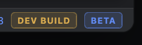

# Warianty BETA/DEV i telemetria offline

## Podsumowanie

- Wprowadzić jawne metadane buildu, niezależne od numeru wersji.
- Lokalne buildy pluginów i aplikacji będą domyślnie wariantem `DEV`; tylko workflowy publikujące
  wydania przekażą `-PreleaseBuild=true`.
- Przy wersji beta lokalny build pokaże równocześnie badge’e `BETA` i `DEV`.
- Buildy DEV nie wykonają update checku, nie uruchomią Amplitude ani Sentry i nie wyślą żadnej
  telemetrii.

## Zmiany implementacyjne

- Dodać w module `:telemetry` współdzielony model metadanych buildu:
  - pełna wersja,
  - `isBeta`, wyliczane z wersji,
  - `isDeveloperBuild`, odczytywane z generowanych properties,
  - efektywny `ReleaseChannel`: `DEV` dla buildów developerskich, w przeciwnym razie `BETA` lub
    `STABLE`.
- Rozszerzyć generowanie `golden-diff-telemetry.properties` w `:app` i `:public-plugin`:
  - domyślnie zapisywać `build.developer=true`,
  - dla `-PreleaseBuild=true` zapisywać `false`,
  - w DEV wymuszać puste klucze Amplitude i Sentry niezależnie od wartości w `gradle.properties` lub
    argumentów CLI.
- Dodać drugą warstwę zabezpieczenia w kodzie hostów:
  - klient telemetryczny w DEV zawsze otrzymuje efektywną pustą zgodę i backend offline,
  - nie pokazywać automatycznego promptu zgody,
  - nie inicjalizować mostka raportującego nieobsłużone wyjątki do Sentry,
  - pozostawić checkboxy telemetryczne widoczne, aktywne i zapisujące preferencje; zaczną obowiązywać
    dopiero w buildzie release.
- Podłączyć nowe metadane do istniejących update checkerów, aby DEV kończył sprawdzanie przed dostępem
  do sieci i nie pokazywał aktualizacji.
- Dodać małe badge’e obok istniejącej informacji o wersji:
  - umieścić cały blok wersji i badge’ów w prawym dolnym rogu stopki okna,
  - badge’e wyświetlać bezpośrednio za informacją o wersji,
  - zachować kolejność `DEV BUILD`, następnie `BETA`, gdy oba dotyczą danego buildu,
  - używać tekstu `BETA` dla wersji prerelease beta oraz `DEV BUILD` dla wariantu developerskiego;
    stable release nie pokazuje żadnego badge’a,
  - Compose: główny status bar aplikacji oraz stopka Settings,
  - Swing: stopka ustawień publicznego pluginu,
  - odwzorować zaokrąglony kształt, obramowanie, wewnętrzne odstępy, kapitaliki i kolory z referencji
    poniżej.
- Domyślny ZIP publicznego pluginu oznaczyć sufiksem `-dev`, zachowując obsługę istniejącego
  `distributionSuffix`; build release zachowa dotychczasową nazwę wymaganą przez publikację.
- Workflowy publikujące publiczny plugin i tagowane wydania appki uruchamiać z
  `-PreleaseBuild=true`. Manualny, nietagowany build aplikacji oraz zwykłe CI pozostaną DEV. Sandbox
  `:internal-plugin:runIde` załaduje developerski, offline build pluginu publicznego.
- Uzupełnić dokumentację buildów o domyślne zachowanie DEV, komendę lokalnego builda release oraz
  gwarancję braku Amplitude/Sentry w DEV.

## Testy

- Testy modelu metadanych: stable, beta, dev oraz jednoczesne `BETA + DEV`.
- Testy telemetryczne potwierdzające, że w DEV zapisane zgody nie tworzą backendu, identyfikatora
  instalacji, eventów, spanów ani raportów wyjątków.
- Testy update checkerów potwierdzające brak wywołania funkcji sieciowej dla DEV.
- Testy czystej reprezentacji badge’ów dla stable, beta, dev i beta-dev.
- Uruchomić `:core:test`, `:telemetry:test`, `:app:test`, `:public-plugin:test` i
  `:internal-plugin:test`.
- Zbudować domyślny plugin DEV oraz release z `-PreleaseBuild=true`; sprawdzić nazwy ZIP-ów i
  zawartość properties.
- Zbudować oba pluginy i potwierdzić dotychczasowe granice: `core.jar` tylko w publicznym ZIP-ie,
  brak Compose/Jewel/Skiko oraz poprawny Java 17.
- Uruchomić aplikację i sandbox pluginu, sprawdzając badge’e, brak promptu telemetrycznego i brak
  update checku w DEV.

## Założenia

- Build DEV zastępuje normalny build podczas lokalnego uruchamiania; nie dostaje osobnego ID aplikacji
  ani pluginu i nie instaluje się obok wersji release.
- Wewnętrzny plugin Figma nie potrzebuje własnego badge’a; podczas developmentu korzysta z oznaczonego
  `DEV` publicznego pluginu.
- Istniejące, niezatwierdzone zmiany dotyczące stopek i update checkerów zostaną zachowane i
  rozszerzone.

## Referencja wizualna

Badge’e mają wyglądać i być rozmieszczone względem siebie jak na poniższej referencji:

